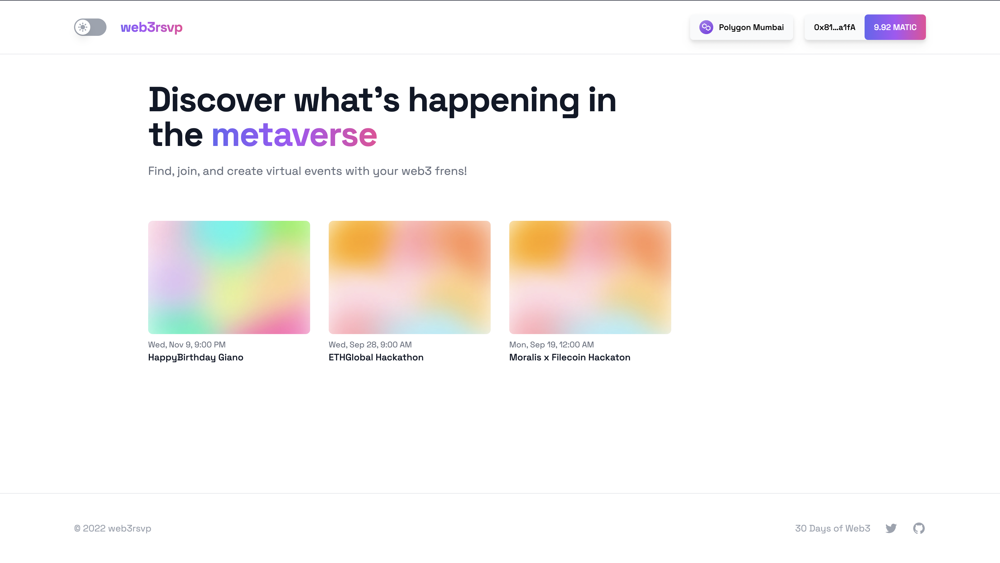
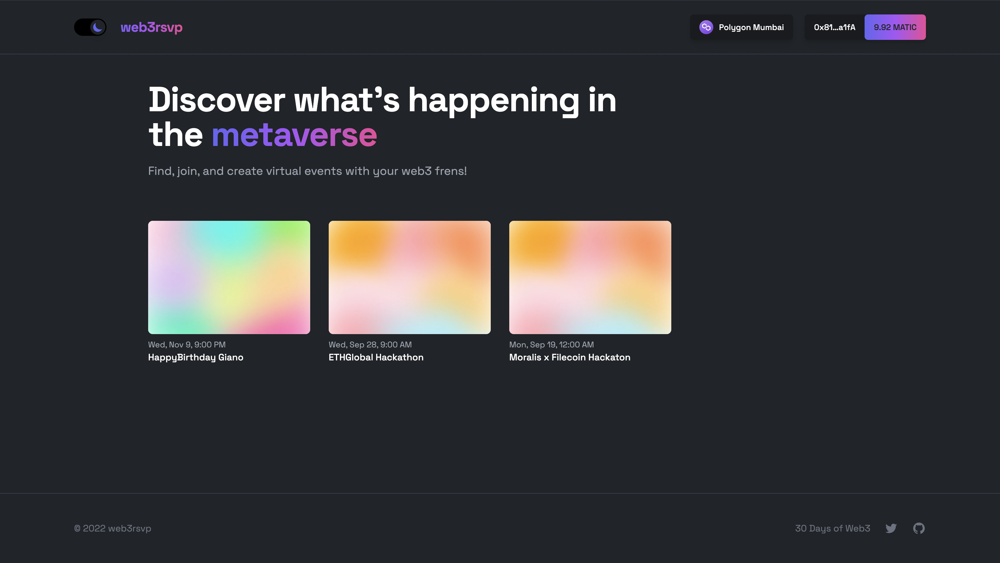

# Web3 RSVP 🚀

<br/>
<p align="center">


</p>
<br/>

This is a Fullstack Web3 dApp that allow you to create, RSVPs and Attendee Events on the Metaverse. Currently it support either Polygon Mumbai and Rinkeby Networks.

-   [Web3 RSVP 🚀](#web3-rsvp-🚀)
-   [Getting Started 🤓](#getting-started-🤓)
    -   [Requirements](#requirements)
    -   [Quickstart](#quickstart)
-   [Backend 🛠](#backend-🛠)
    -   [Deployment to the Hardhat net](#deployment-to-the-hardhat-net)
    -   [Deployment to Rinkeby and Mumbai testnet](#deployment-to-rinkeby-and-mumbai-testnet)
-   [The Graph 🔍](#the-graph-🔍)
    -   [Setup](#setup)
    -   [Build & Deploy Rinkeby](#build--deploy-rinkeby)
    -   [Build & Deploy Mumbai](#build--deploy-mumbai)
-   [Frontend 🖥](#frontend-🖥)
    -   [Setup local variables](#setup-local-variables)
    -   [Run Locally](#run-locally)
-   [Thanks 🎉](#thanks-🎉)

# Getting Started 🤓

## Requirements

-   [git](https://git-scm.com/book/en/v2/Getting-Started-Installing-Git)
    -   You'll know you did it right if you can run `git --version` and you see a response like `git version 2.32.1`
-   [Nodejs](https://nodejs.org/en/)
    -   You'll know you've installed nodejs right if you can run:
        -   `node --version` and get an ouput like: `v16.16.0`
-   [Yarn](https://classic.yarnpkg.com/lang/en/docs/install/) instead of `npm`
    -   You'll know you've installed yarn right if you can run:
        -   `yarn --version` and get an output like: `1.22.19`
        -   You might need to install it with `npm`
-   [graph-cli](https://www.npmjs.com/package/@graphprotocol/graph-cli) run the yarn command
    -   You'll know you did it right if you can run `graph --version` and you see a response like `0.33.0`

## Quickstart

```
git clone https://github.com/giano95/web3rsvp.git
cd web3rsvp
yarn
```

# Backend 🛠

## Deployment to the Hardhat net

Try to Deploy and Test the contract on the Hardhat Network and see if everything go smooth without error.

```
yarn hardhat deploy
yarn hardhat test
```

You can see the coverage of the Test by typing:

```
yarn hardhat coverage
```

## Deployment to Rinkeby and Mumbai testnet

The first thing to do is setup the environment variables, in particular `RINKEBY_RPC_URL`, `MUMBAI_RPC_URL` and `PRIVATE_KEY`. You can add them to a `.env` file, similar to what you see in `.env.example`.

-   `PRIVATE_KEY`: The private key of your account (like from [metamask](https://metamask.io/)). You can [learn how to export it here](https://metamask.zendesk.com/hc/en-us/articles/360015289632-How-to-Export-an-Account-Private-Key).
-   `RINKEBY_RPC_URL`: This is url of the Rinkeby testnet node you're working with. You can get setup with one for free from [Alchemy](https://alchemy.com/?a=673c802981)
-   `MUMBAI_RPC_URL`: This is url of the Mumbai testnet node you're working with. You can get setup with one for free from [Alchemy](https://alchemy.com/?a=673c802981)

In order to autamically verify the contract once deployed you need to set:

-   `ETHERSCAN_API_KEY`: This is the API Key of Etherscan, you can get one here [Etherscan](https://etherscan.io/myapikey)
-   `POLYGONSCAN_API_KEY`: This is the API Key of Polygonscan, you can get one here [Polygonscan](https://polygonscan.com/myapikey)

To deploy the contracts you need some token to pay for the gas fees:

-   Head over to [rinkebyfaucet](https://rinkebyfaucet.com/) and get some tesnet ETH. You should see the ETH show up in your metamask.
-   Head over to [mumbaifaucet](https://mumbaifaucet.com/) and get some tesnet MATIC. You should see the MATIC show up in your metamask.

Now it's finally time to Deploy:

```
yarn hardhat deploy --network rinkeby
yarn hardhat deploy --network polygonMumbai
```

If everything go smooth you should see the Hashes of the deployed contracts on the console at run-time and also on the `exportContracts.json` file with the contract abis.

# The Graph 🔍

## Setup

First LogIn/SignUp into [thegraph](https://thegraph.com/hosted-service/dashboard) and click ont the Add Subgraph button and create two Subgraph with the following name:

-   `web3rsvp-rinkeby-2`: the one used to indexing and query data from the Rinkeby contract.
-   `web3rsvp-mumbai-2`: the one used to indexing and query data from the Mumbai contract.

Then generate the code:

```
graph codegen
```

And authenticate to your account by replacing `<access-token>` with your token:

```
graph auth --product hosted-service <access-token>
```

Now change the contracts addresses and starting blocks in the `networks.json` file with yours (the ones that you deployed [here](#deployment-to-rinkeby-and-mumbai-testnet))

## Build & Deploy Rinkeby

Build the graph with the Rinkeby dataSource info, and then deployed to its respective subgraph (replace `<account-name>` with your).

```
graph build --network rinkeby
graph deploy --product hosted-service <account-name>/web3rsvp-rinkeby-2 --network rinkeby
```

If everything go well you should be able to enter your subgraph, click the play button and run the example query without any error.

## Build & Deploy Mumbai

Build the graph with the Mumbai dataSource info, and then deployed to its respective subgraph (replace `<account-name>` with your).

```
graph build --network mumbai
graph deploy --product hosted-service <account-name>/web3rsvp-mumbai-2 --network mumbai
```

If everything go well you should be able to enter your subgraph, click the play button and run the example query without any error.

# Frontend 🖥

## Setup local variables

The first thing to do is setup the environment variables, you can add them to a `.env.local` file, similar to what you see in `.env.example.local`.

-   `WEB3STORAGE_TOKEN`: This is the API Token used to upload data into ipfs. You can get one [here](https://web3.storage/tokens/) after signing up.
-   `NEXT_PUBLIC_POLYGON_MUMBAI_ALCHEMY_ID`: This is API Key of the Rinkeby app that you prevously created on [Alchemy](https://alchemy.com/?a=673c802981)
-   `NEXT_PUBLIC_RINKEBY_ALCHEMY_ID`: This is API Key of the Mumbai app that you prevously created on [Alchemy](https://alchemy.com/?a=673c802981)

For easiness we are gonna also set the block's explorer urls:

-   `NEXT_PUBLIC_MUMBAI_POLYGONSCAN_URL`: https://mumbai.polygonscan.com/
-   `NEXT_PUBLIC_RINKEBY_ETHERSCAN_URL`: https://rinkeby.etherscan.io/

The last step of the setup is gonna be replace the Endpoint of the subgraphs we [previously](#the-graph) deployed. To do that replace the http queries with yours http queries in `apollo-client.js`.

```
const rinkebyEndpoint = new HttpLink({
    uri: "<web3rsvp-rinkeby-2-http-queries>",
})
const mumbaiEndpoint = new HttpLink({
    uri: "<web3rsvp-mumbai-2-http-queries>",
})
```

## Run locally

Now it's time to finally run locally on your web broswer this dApp, just run:

```
const rinkebyEndpoint = new HttpLink({
    uri: "<web3rsvp-rinkeby-2-http-queries>",
})
const mumbaiEndpoint = new HttpLink({
    uri: "<web3rsvp-mumbai-2-http-queries>",
})
```

And pray 🙏 the gods of conding that everything will go smoothly

# Thanks 🎉

A special thanks to all the team of [30DaysofWeb3](https://www.30daysofweb3.xyz/) for the amazing project and the support given through the Discord Community. Also if you appreciated this, feel free to follow me or donate!

Metamask Address: 0x9680201d9c93d65a3603d2088d125e955c73BD65

[](https://twitter.com/ERC_721Holder)
[](https://www.instagram.com/marco_gianelli_ifbbbro/)
